# SQL Architect to OpenAPI 

   

[This tool](https://github.com/bheuse/SQL_Architect_to_OpenAPI) converts an SQL Architect project into an OpenAPI 3.0.2 Data Model & CRUD Operations.

A JSON Schema can also be generated.

Code generation is supported through template design.

## Install SQL Architect :

[Download SQL Architect](http://www.bestofbi.com/page/architect)

SQL Architect requires Oracle Java Version.

### Configure SQL Architect :

Install and navigate menu : `File / User Preferences / Default Column Setting`

Configure as follow:
- Column Name by Default : `PropertyName`
- Column Type by Default : `VARCHAR`
- Column Precision by Default : 225
- Column Allow Nulls by Default : Yes
- Value By Default : `noExampleValue`
- Column Remarks By Default : 

    Enter Description Here
    <schema> {
       "name": "noName",
       "key": false,
       "filter": false,
       "description": "noDescription",
       "tooltip": "noTooltip",
       "type": "string",
       "format": "noFormat",
       "possibleValues": [ "noExampleValue", "noDefaultalue" ] ,
       "defaultValue": "noDefaultalue",
       "example": "noExampleValue",
       "validationScript": "",
       "applicableTo": "noApplicableTo",
       "minCardinality": 1,
       "maxCardinality": 1,
       "validFor": "novalidFor",
       "markdownDescription": "no-MarkdownDescription",
       "valueSpecification": "noValueSpecification"
    } </schema>

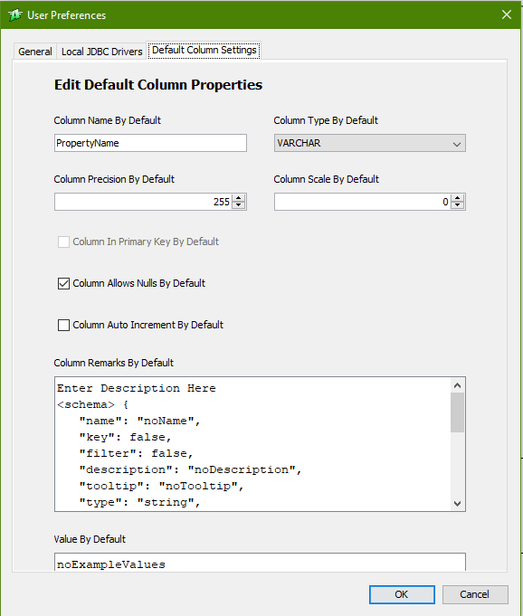

## Create your Data Model :

See below how to Model with SQL Architect for OpenAPI:

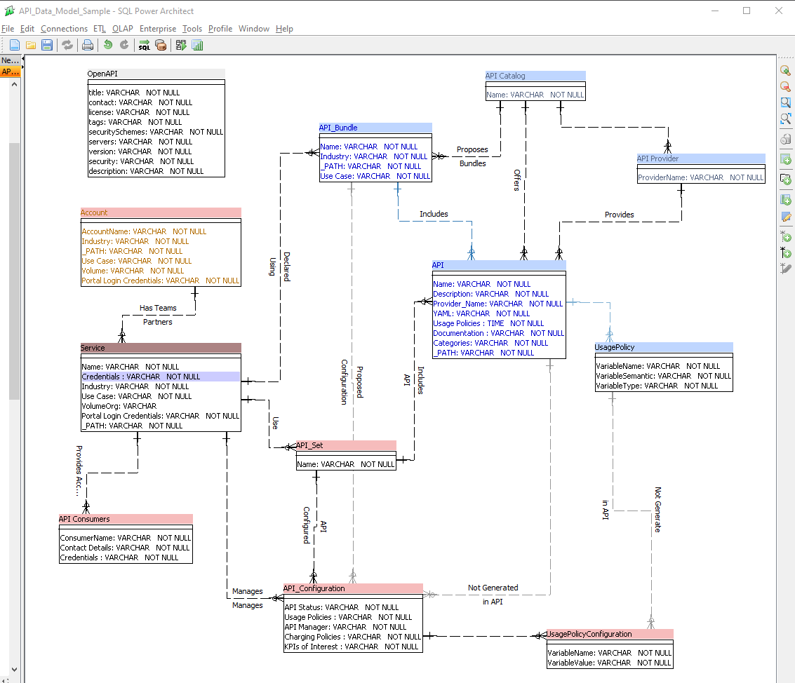

## Generate your API: 

    python    .\data_model_to_openapi.py -m .\API_Data_Model_Sample
    Reading : .\API_Data_Model_Sample.architect
    Ready   : .\API_Data_Model_Sample.yaml

## View your API: 

[View your APIs once generated in Swagger Editor : ](https://editor.swagger.io/)

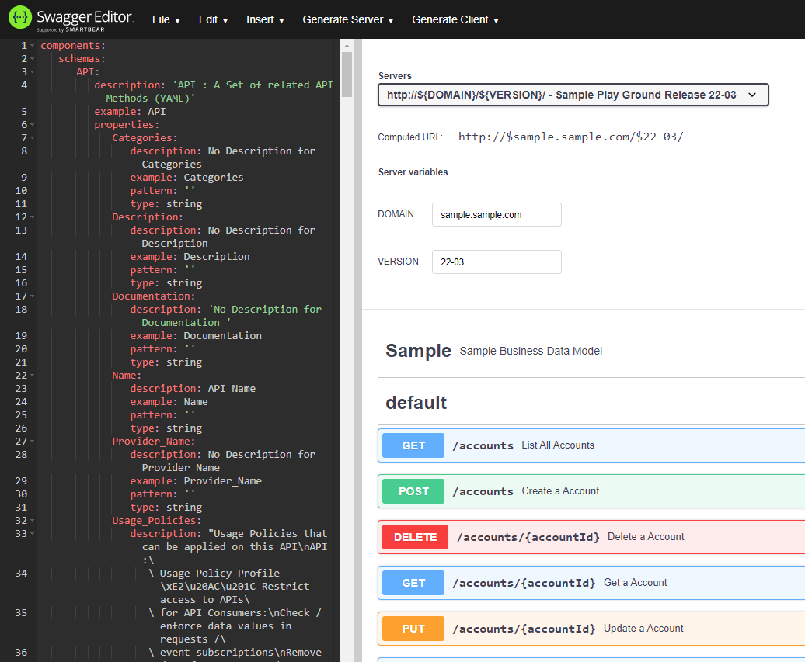

[View your APIs once generated in Apicurio Studio](https://studio.apicur.io/)

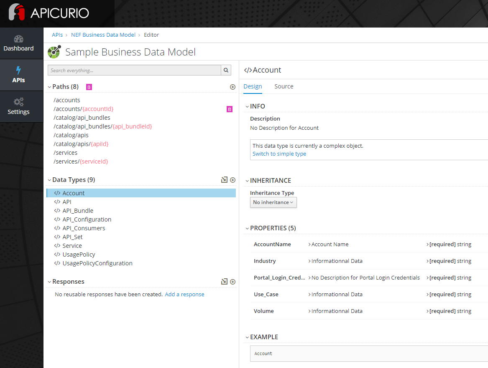

## Next Steps:

Use OpenAPI Code Generation Tools like Swagger Editor or PostMan to generate server stubs or client SDK.

## How to Model in SQL Architect for OpenAPI:

The content of the SQL Architect Data Model in SQL Architect will be used as follow:

    Table:
        Logical Name  = API Object Type
        Physical Name = Examples    
        Remarks       = Description 
        Primary Key   = Not Used (complex)  
        Ignore : if the Physical name contain "ignore", the object schema will not be generated

        Attribute:
            Logical Name  = API Property Name
            Physical Name = Examples
            Remarks       = Description
            Allow Nulls   = Required / Optional if Ticked
            Type          = String, Integer, Time, Boolean
            Default Value = Pattern 

        Relation:
            Name        = If FK name contains ignore, the relation will nor refer to sub-object attribute
            Description = PK Label + FK Label
            Cardinalite = <NOT IMPLEMENTED>

        Special Attributes
            Name          = _PATH (Generates a CRUD list of operations for this object)
                                _PATH Physical Name : Used as PATH Name
                                _PATH Default value : Used as Path Name Prefix
                                    https://domain.com<Default value>/<Physical Name>
                                    Exemple for https://domain.com/products/tools
                                      - Default value = "/products"
                                      - Physical Name = "tools"
                                _PATH Remarks : Operations to be supported. If contains 
                                      - read-only          => list (GET /<entities>) - read (GET /<entities>/<entity>) 
                                      - read-create        => list - read - create (POST /<entities>/<entity>)
                                      - read-create-patch  => list - read - create - patch (PATCH /<entities>/<entity>)
                                      - read-write         => list - read - create - update (PUT /<entities>/<entity>) -- delete (DELETE /<entities>/<entity>)
                                      - otherwise list / get / put / post / delete
                                      - <parameters>  </parameters> used for parameters description
                                           Path Parameters   : "path_parameters"  
                                           Query Paramenters : "get_parameters",    "list_parameters", 
                                                               "post_parameters",   "patch_parameters", 
                                                               "delete_parameters", "put_parameters",  
                                           Schema level Parameters : "schema_parameters" 
                                           Example adding a query parameter to the GET operation :
                                            <parameters> 
                                               <get_parameters>
                                                  { "in"       : "query" ,
                                                     "name"     : "schema" , 
                                                     "required" : false,
                                                     "description": "Return the Configuration Schema.",
                                                     "schema": {
                                                        "type": "boolean"
                                                        }
                                                  }
                                               </get_parameters>
                                            </parameters>

    The "OpenAPI" Table is used to define the API details in  attributes:
        "title"           : Physical Name used as API Title
        "description"     : Physical Name + Remarks used as API Description
        "version"         : Physical Name used as API Version
        "contacts"        : Remarks in JSON Format used as API Contacts
        "license"         : Remarks in JSON Format used as API License
        "tags"            : Remarks in JSON Format used as API tags
        "servers"         : Remarks in JSON Format used as API Servers
        "security"        : Remarks in JSON Format used as API Security
        "securitySchemes" : Remarks in JSON Format used as API SecuritySchemes

### Pagination Support

Pagination query parameters are automatically generated for _PATH entities:

    paths:
      /datastore/APIs:
        summary: Path used to manage the list of apis.
        get:
          summary: List All APIs
          parameters:
          - in: query
            name: limit
            schema:
              type: integer
            description: Pagination Limit
          - in: query
            name: offset
            schema:
              type: integer
            description: Pagination Offset

Please note pagination in responses in not supported in the schema for now:
- self, first, next, prev, last page links
- this page number, total number of pages, total count of entries 

are not documented in the returned objects schema (this count be improvement). 

### Filtering Support

If the attribute of an _PATH entity has its `filter` set to `true` in its schema, 
then a filter query parameter will be added to the list GET operation :

`"filter": true`

    <schema> {
       "name": "noName",
       "key": false,
       "filter": true,
       "description": "noDescription",
       "tooltip": "noTooltip",
       "type": "string",
       "format": "noFormat",
       "possibleValues": [ "noExampleValue", "noDefaultalue" ] ,
       "defaultValue": "noDefaultalue",
       "example": "noExampleValue",
       "validationScript": "",
       "applicableTo": "noApplicableTo",
       "minCardinality": 1,
       "maxCardinality": 1,
       "validFor": "novalidFor",
       "markdownDescription": "no-MarkdownDescription",
       "valueSpecification": "noValueSpecification"
    } </schema>

Generates :

    paths:
      /datastore/APIs:
        summary: Path used to manage the list of apis.
        get:
          summary: List All APIs
          parameters:
          - in: query
            name: API_Provider_Name
            schema:
              type: string
            description: Filter for API_Provider_Name

### Table OpenAPI:

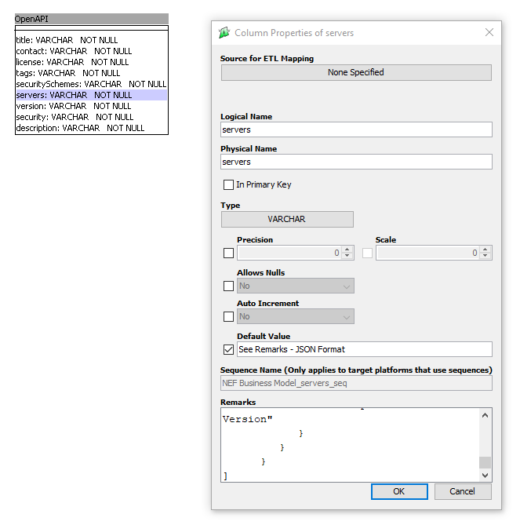

Becomes:

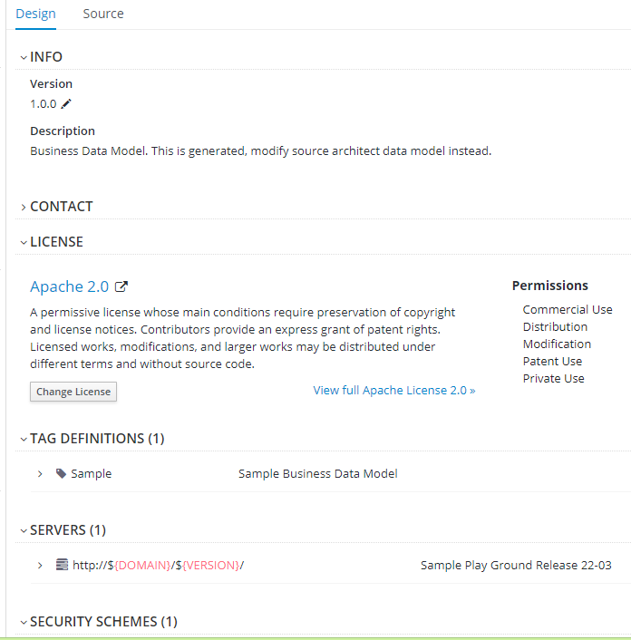

## Code Generation

The tool supports code generation, using [mako template engine](https://docs.makotemplates.org/en/latest/usage.html).

All files stored in `<model>_templates` are considered as being Mako Template files.

They will be scanned and template generated in the `<model>_artifacts` directory.

The whole `<model>_templates` directory structure is scanned and replicated in `<model>_artifacts`. 

The variables that can be used in the template are generated on the first schema generation, in file 

`<model>_artifacts/<model>_context.[yaml|json]`

All entities, attributes are documented in the context and can be used for code generation.`

An example of mako template for DDL generation:
 
    <%doc>
        DDL Template for VoltDB
    </%doc>
    # DDL for ${DATAMODEL}
    
    % for ENTITY in ENTITIES:
    CREATE TABLE ${ENTITY} (
    % for PROP in ENTITIES[ENTITY]["properties"]:
        ${PROP}  VARCHAR ${'' if loop.last else ','}
    % endfor
    );
    % endfor

Java code and most of other artifact can be generated in this manner, defining the appropriate templates.

It is suggested that custom business logic (e.g. data consitency checks) to be developped in 
external hooks.

The generated code can invoke the hook, and the hook is developped manually. 
The hook should receive the payload to verify as input, 
and return either an error or an updated payload.

### Code Generation per Entities

Code can be generated by Entities having the _PATH attribute.

If a file or a directory has a name in the form `<model>_templates/prefix_${ENTITY}_name`,
then one file or directory per entities with the _PATH attribute will be generated.

Instead of passing the overall project context for code generation, only the context for this object type is available.
The context can be examined in the files `<model>_artifacts/<entity_name>_context.[yaml|json]` generated in the artifact root directory (onne for each entity).

### Adding Extra Context for Code Generation 

If additional context information is necessary to be added in template context (adding place-holders keywords),
this can be done either within the model, or in a separate file:

#### In Model :
- Create a context attribute in the OpenAPI entity.
- Set the necessary context in the remarks field, in JSON format.

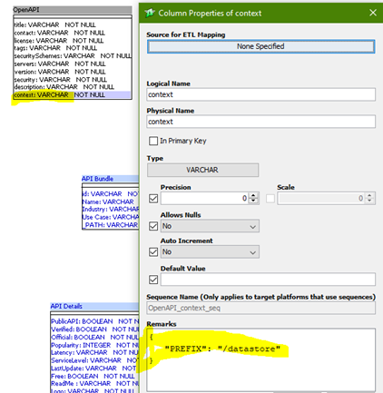

#### In Separate file :
- Create a file with the context as content in JSON or YAML format.
- Specify the file path in the command line parameter : -c <context_file>.[json|yaml]

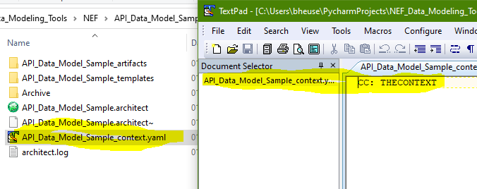

### Template Includes

- External template files can be included and reused in several templates.
- This can be combined with %def blocks.

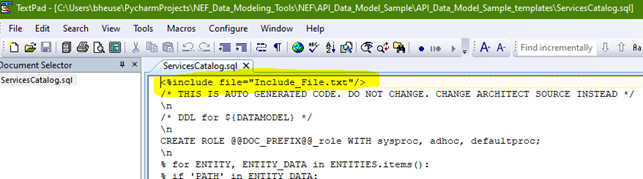

- All included files should be in a single include directory 
- Specify include directory path in the command line parameter : -i <dir>

### Template and Artifact Directory Locations 

- Specify templates source directory path in the command line parameter : -t <dir>
- Specify artifacts destination directory path in the command line parameter : -a <dir>

### Model File Location

- Specify architect model file path in the command line parameter : -m <file>

### Command Line Usage 

    Usage: -v -r -y -o -s -d -m <model> -t <templates_dir> -a <artifacts_dir> -i <includes_dir> -c <context_file>  
           -m --model    <file> : Generate for model <model_file>.architect                 
           -c --context  <file> : Context File for rendering <context_file>.[json|yaml]                 
           -t --templates <dir> : Use <dir> as templates dir                      
           -a --artifacts <dir> : Use <dir> as artifacts dir                      
           -i --include   <dir> : Use <dir> as include template dir                      
           -r --render      : Render <model_file>_template dir into <model_file>_artifacts dir
           -y --yaml        : Generate OpenAPI Yaml <model_file>_artifacts dir
           -o --openapi     : Generate OpenAPI Yaml <model_file>_artifacts dir
           -s --schema      : Generate JSON Schema  <model_file>_artifacts/_Schemas dir
           -d --datastore   : Generate and provision ANME Datastore               
           -v --verbose     : Verbose    

# DbSchema to OpenAPI 

**_DbSchema conversion is no longer supported - the freemium version does not allow to edit DB Schema._** 

[This tool](https://github.com/bheuse/SQL_Architect_to_OpenAPI) converts a DbSchema project into an OpenAPI 3.0.2 Data Model & CRUD Operations 

## Create your Data Model :

[Download DbSchema](https://dbschema.com/)

Project Type muse be "LogicalDesign"

See below how to Model with DbSchema for OpenAPI:

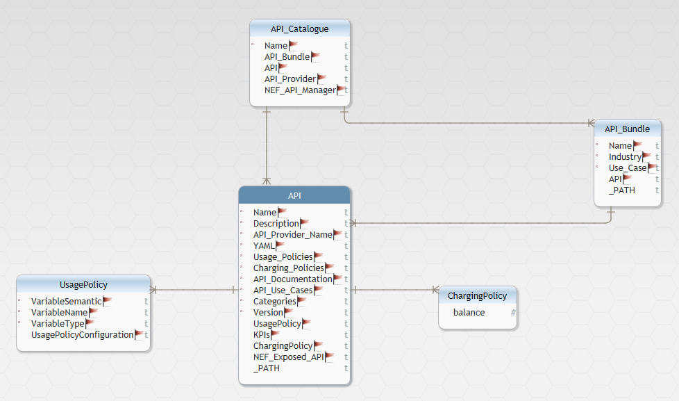

## Generate your API: 

    python    .\db_schema_to_openapi.py .\API_Data_Model_Sample
    Reading : .\API_Data_Model_Sample.dbs
    Ready   : .\API_Data_Model_Sample.yaml

## Next Steps:

Use OpenAPI Code Generation Tools like Swagger Editor or PostMan to generate server stubs or client SDK.

## How to Model in DBSchema for OpenAPI:

The content of the DBSchema Data Model in DBSchema will be used as follow:

    Table: are mapped onto API Object 
        Table Name    = Mapped onto an API Object Type
        Description   = Description 
        Specification Options = Examples    
           Ignore : if the Specification Options contain "ignore", the object schema will not be generated
        Options Suffix         :  For Future use ?
        Options Append  Script : For Future use ?
        Options Prepend Script : For Future use ?
        Primary Key   = Not Used (complex)  

        Attribute:
            Name          = API Property Name
            Description   = <Description> [Examples: <Examples>]
            Examples      = [<Description> Examples:] <Examples>
            Mandatory     = Required / Optional if unticked
            Type          = varchar, text    -> string, 
                            integer, int     -> integer, 
                            date, datetime   -> string, 
                            boolean          -> boolean, 
                            numeric, decimal -> number
            Default Value = Pattern 

        Relations:
            Name        = If name contains ignore, the relation will nor refer to sub-object attribute
            Description = Description
            Entity      = Contained  Object (from table)
            Entity(?)   = Containing Object (to table)
            Type        = Cardinality : 
                          OneToOne => OneToOne  (single sub-object) 
                          others   => OnetoMany (array of sub-object)

        Special Attributes
            Name          = _PATH (Generates a CRUD list of operations for this object)
                            _PATH Containing Entity Name : Used as PATH Name
                            _PATH Default : Used as Path Name Prefix
                            _PATH Description : if contains 
                               read-only => only get operation 
                               otherwise => get / put / post / delete

    The "OpenAPI" Table is used to define the API details in  attributes:
        "title"           : Description used as API Title
        "description"     : Description used as API Description
        "version"         : Description used as API Version
        "contacts"        : Description in JSON Format used as API Contacts
        "license"         : Description in JSON Format used as API License
        "tags"            : Description in JSON Format used as API tags
        "servers"         : Description in JSON Format used as API Servers
        "security"        : Description in JSON Format used as API Security
        "securitySchemes" : Description in JSON Format used as API SecuritySchemes

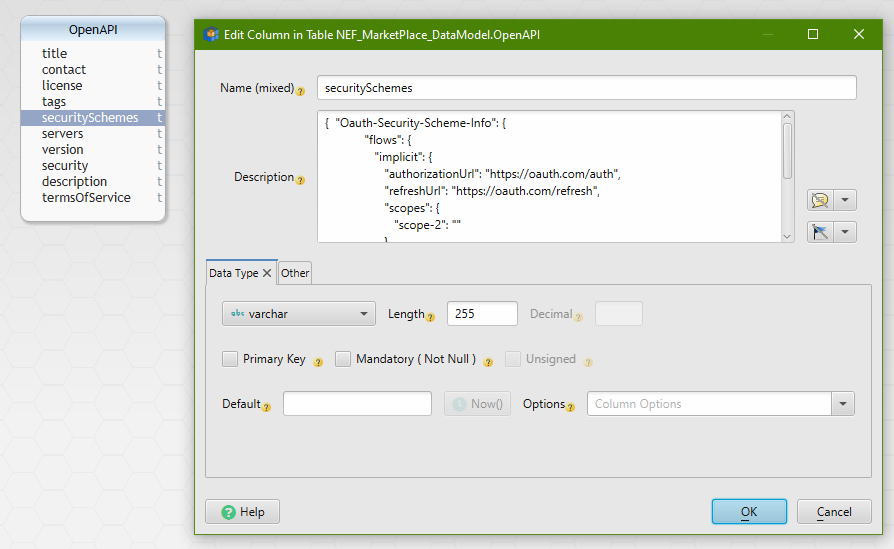
